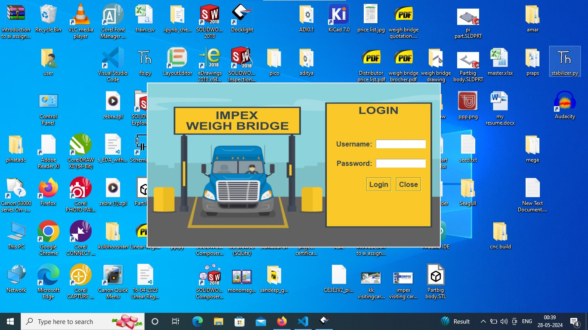
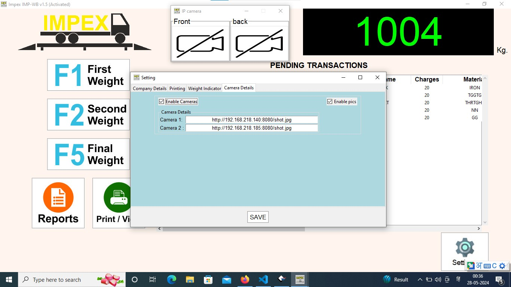
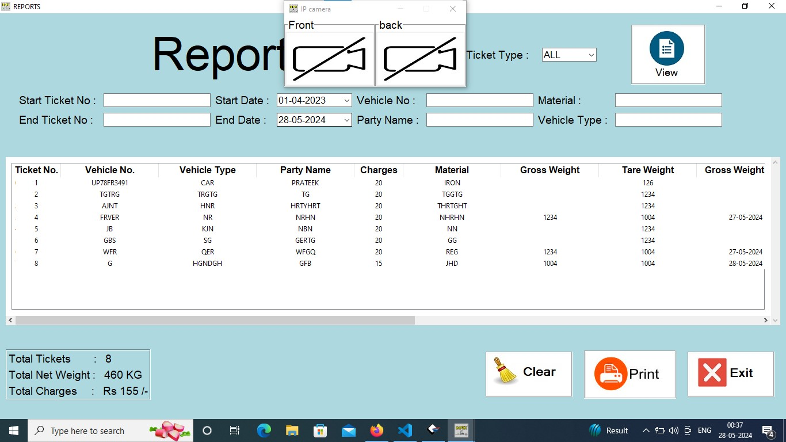
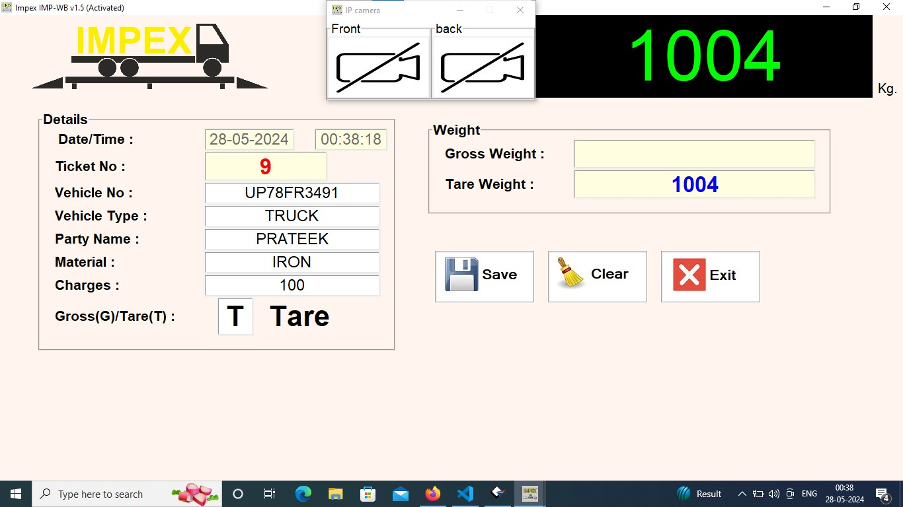
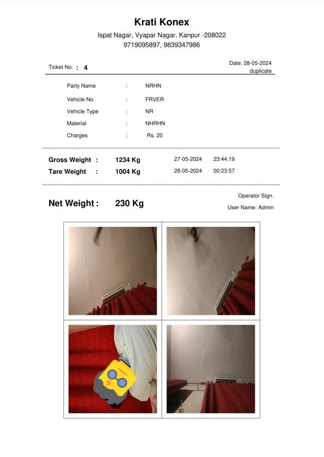
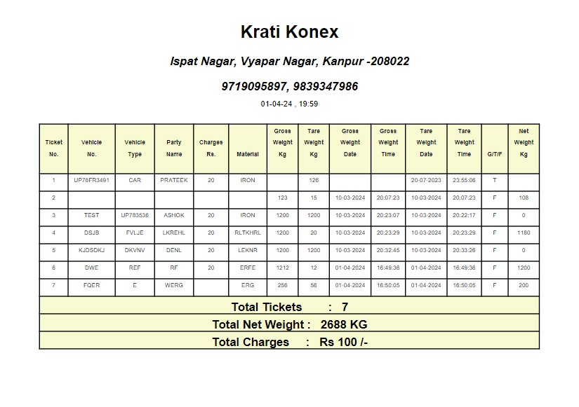

# Weigh Bridge Management system
auther --Prateek Tripathi

# Weigh Bridge Ticket Printer

This project generates and prints weigh bridge tickets as PDF files using Python. It can integrate with a laser printer, a weighing indicator via a serial port, print detailed reports, and integrate with two IP cameras for capturing images of vehicle. The tickets include details such as party name, vehicle number, weight information, and more, and can be printed directly to a configured printer.

## Features

- Generate weigh bridge tickets as PDFs.
- Integrate with a laser printer for direct printing.
- Connect to a weighing indicator via a serial port.
- Print detailed reports.
- Integrate with 2 IP cameras for capturing images.
- Include party, vehicle, and weight information.
- Embed images in a 2x2 grid layout within the ticket.

## Screenshots
### GUI

### Example PDF Ticket

### Example PDF Report

